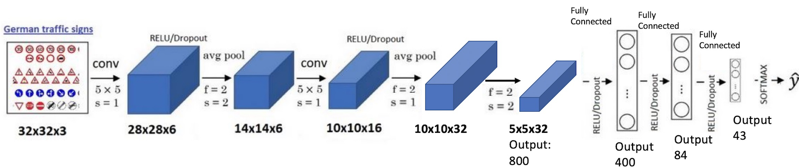
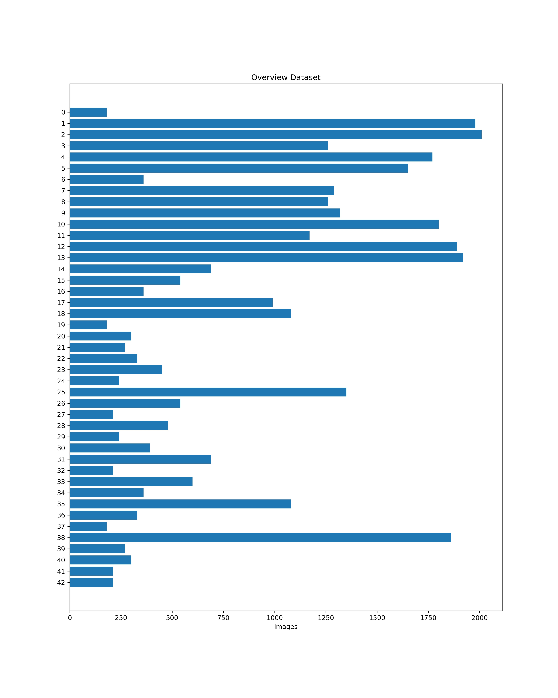
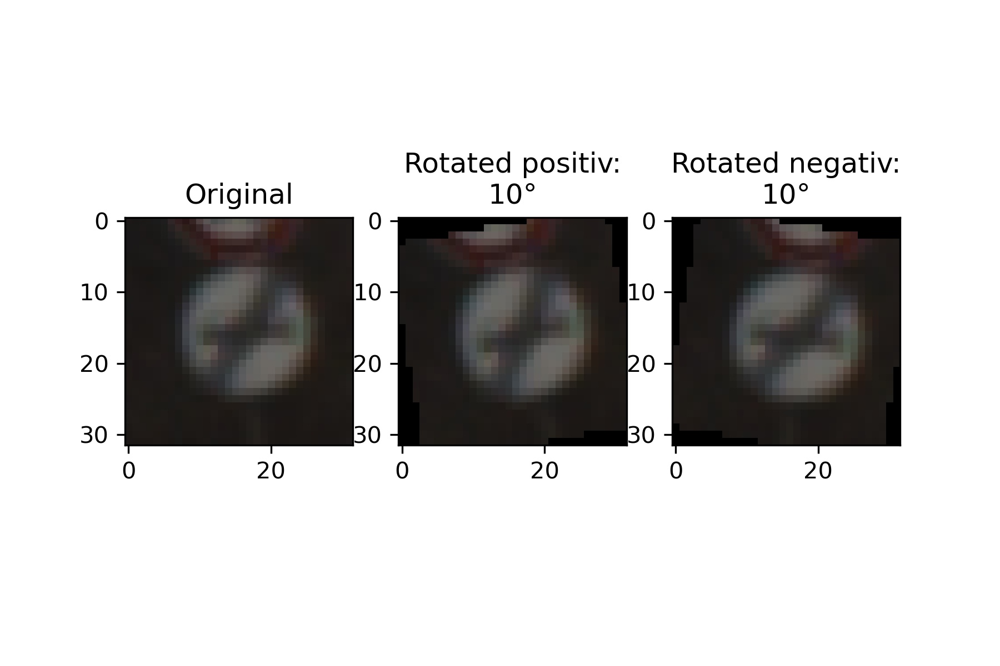
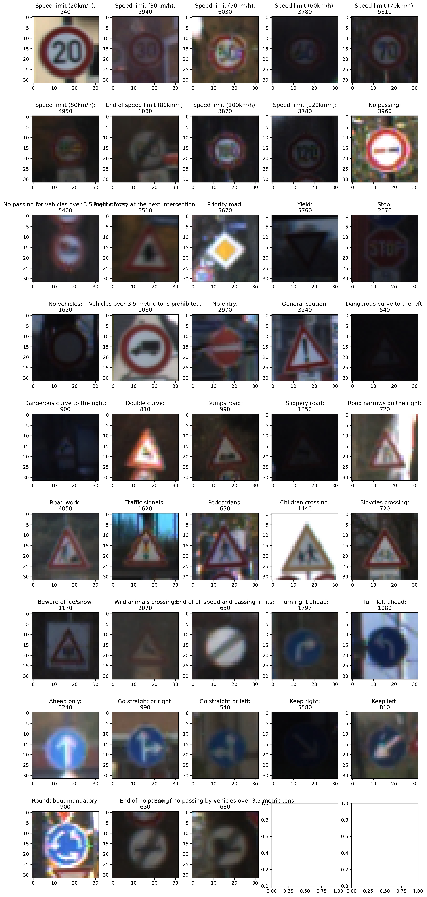
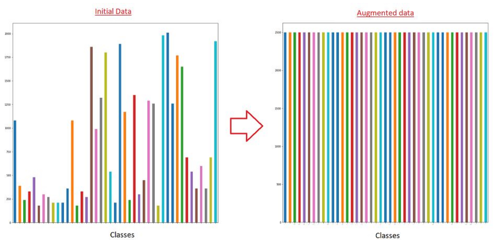
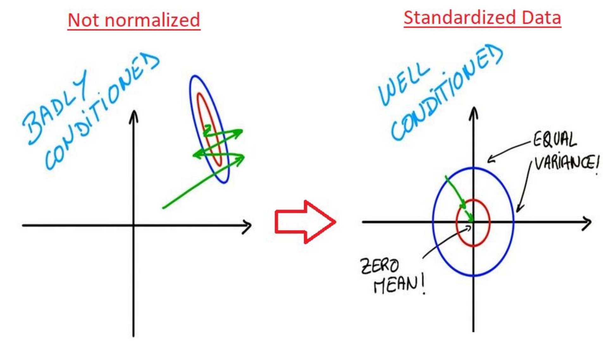
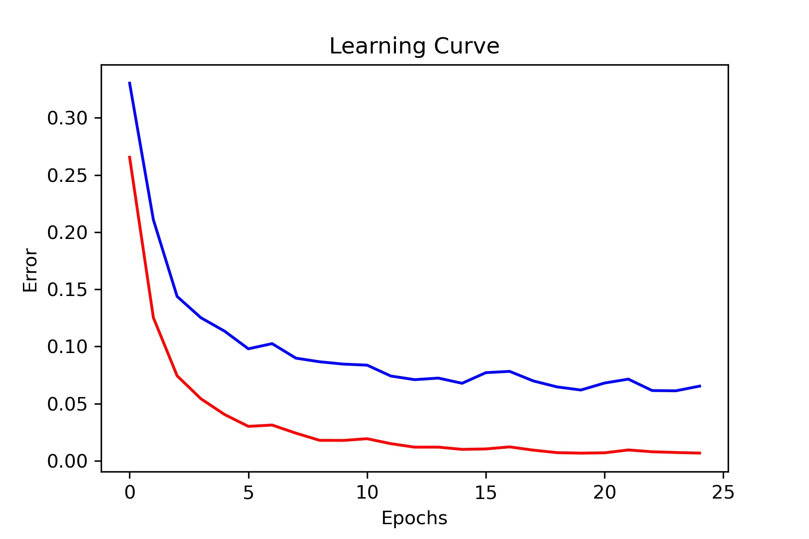
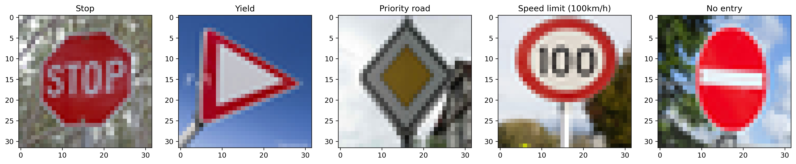

# **Traffic Sign Recognition** 

## Abstract

A Traffic Sign Classifier that uses a LeNet-5 model and is trained with german traffic sign. To increase the learning of the net three methods are used. 1. Argumentation 2. Normalization 3. Shuffling  
1. Augmentations of the dataset are used to increase the generalization by rotating the pictures, so that even less represented images are equal distributed  in the dataset. 
2. Normalization substitutes the brightness effect of the images. It scales the intensities to prevent early saturation of non-linear activations functions. 
3. Last but not least shuffling of the data set avoids overfitting by giving in the specific time period much weight to the specific neuron at letting other weights and neurons getting worse by not activating the in time on class is learned.

The steps of this project are the following:
* Load the data set (see below for links to the project data set)
* Explore, summarize and visualize the data set
* Design, train and test a model architecture
* Use the model to make predictions on new images
* Analyze the softmax probabilities of the new images
* Summarize the results with a written report

<figure>
 
 <figcaption>
 

 
 
 
 
 </figcaption>
</figure>
 

### Here I will consider the [rubric points](https://review.udacity.com/#!/rubrics/481/view) individually and describe how I addressed each point in my implementation.  

---
#### 1. Provide a Writeup / README that includes all the rubric points and how you addressed each one. You can submit your writeup as markdown or pdf. You can use this template as a guide for writing the report. The submission includes the project code.

You're reading it! and here is a link to my [project code](https://github.com/DiegelD/Traffic_Sign_Classfier/blob/master/Traffic_Sign_Classifier.ipynb)

### 1 Data Set Summary & Exploration

#### 1. Provide a basic summary of the data set. In the code, the analysis should be done using python, numpy and/or pandas methods rather than hardcoding results manually.

I used the pandas library to calculate summary statistics of the traffic
signs data set:

* The size of training set is: 34799 samples
* The size of the validation set is: 4410 samples  
* The size of test set is: 12630 samples
* The shape of a traffic sign image is: 29,29
* The number of unique classes/labels in the data set is: 43

<figure>
 
 <figcaption>
 

 
 
 
 
 </figcaption>
</figure>
 

### Here I will consider the [rubric points](https://review.udacity.com/#!/rubrics/481/view) individually and describe how I addressed each point in my implementation.  

---
### README

#### 1. Provide a Writeup / README that includes all the rubric points and how you addressed each one. You can submit your writeup as markdown or pdf. You can use this template as a guide for writing the report. The submission includes the project code.

You're reading it! and here is a link to my [project code](https://github.com/DiegelD/Traffic_Sign_Classfier/blob/master/Traffic_Sign_Classifier.ipynb)

### 1 Data Set Summary & Exploration

#### 1. Provide a basic summary of the data set. In the code, the analysis should be done using python, numpy and/or pandas methods rather than hardcoding results manually.

I used the pandas library to calculate summary statistics of the traffic
signs data set:

* The size of training set is: 34799 samples
* The size of the validation set is: 4410 samples  
* The size of test set is: 12630 samples
* The shape of a traffic sign image is: 29,29
* The number of unique classes/labels in the data set is: 43

#### 2. Include an exploratory visualization of the dataset.

In Fig. 1.1 is an overview over the data set. This visualize pretty well that the set is not well-adjusted. This will lead to problems in the learning, hence not every class equally represented. Some classes will be better learned then others. To provide more data for the net to learn the exciting training data is extended with rotated its rotated data. In Fig. 1.2 is a example o the rotated images. 

To have a better overview over the data in Fig. 1.3 are all classes with an image and the final number of samples are presented. 
 

<figure>
 
 <figcaption>
 

 
 
 Fig. 1.1: Overview Dataset
 
 </figcaption>
</figure>
 

<figure>
 
 <figcaption>
 

 
 
 Fig. 1.2: Figure original rotated
 
 </figcaption>
</figure>
 

<figure>
 
 <figcaption>
 

 
 
 Fig. 1.3: Dataset Visualization with extended rotation images
 
 </figcaption>
</figure>
 

### 2 Design and Test a Model Architecture

#### 1. Describe how you preprocessed the image data. What techniques were chosen and why did you choose these techniques? Consider including images showing the output of each preprocessing technique. Pre-processing refers to techniques such as converting to grayscale, normalization, etc. 

For the Preprocessing are three methods are used:

1) Augmentations help the model generalize better and prevent overfitting on training data. Since, signs can be present in various orientations in a picture, augmentation the training dataset should dramatically improve model performance. The optimal way to do this is seen in Fig. 2.1.1 Every Class should have the same amount of that, so that it can be assured that every class is learned equally. In this project, a quick way has been chosen that tribble the data amount of all classes. By rotating the available data once by +10° and once - 10°. For more information have a look into chapter 1.2.

<figure>
 
 <figcaption>
 

 
 
 Fig. 2.1.1: Argumented Data Example
 
 </figcaption>
</figure>
 

2) The normalization substitute the brightness effect of the image. It resembles a normal distribution (zero mean and unitary variance) Fig. 2.1.2. It scales the intensities within [0,1] or [-1,1] to prevent early saturation of non-linear activation function output (eg. sigmoid or relu) assuring that all input data is in the same rage. Also, it increases the learning seed because the distribution of the activations is not constantly changing. [More Info](https://stats.stackexchange.com/questions/185853/why-do-we-need-to-normalize-the-images-before-we-put-them-into-cnn)

<figure>
 
 <figcaption>
 

 
 
 Fig. 2.1.2: Normalization visualisation
 
 </figcaption>
</figure>
 

3) Shuffling the data helps to avoid overfitting by giving in the specific time period much weight to the specific neuron at letting other weights and neurons getting worse by not activating the in time on class is learned.

 
#### 2. Describe what your final model architecture looks like including model type, layers, layer sizes, connectivity, etc.) Consider including a diagram and/or table describing the final model.

As architecture the LeNet5 is choosen. Its a simple and well suited arictecure for image reconization. 

<figure>
 
 <figcaption>
 

 
 
 Fig. 2.2: Model architecture
 
 </figcaption>
</figure>
 

#### 3. Describe how you trained your model. The discussion can include the type of optimizer, the batch size, number of epochs and any hyperparameters such as learning rate.

The model is trained with following parameters:

* EPOCHS = 25
* BATCH_SIZE = 128
* dropout = 0.7
* learning rate = 0.0005
* optimizer: AdamOptimizer

#### 4. Describe the approach taken for finding a solution and getting the validation set accuracy to be at least 0.93. Include in the discussion the results on the training, validation and test sets and where in the code these were calculated. Your approach may have been an iterative process, in which case, outline the steps you took to get to the final solution and why you chose those steps. Perhaps your solution involved an already well known implementation or architecture. In this case, discuss why you think the architecture is suitable for the current problem.

My final model results were:
* training set accuracy of 99.4%
* validation set accuracy of 93.8%
* test set accuracy of 91.9%

* What are some of the important design choices and why were they chosen? For example, why might a convolution layer work well with this problem? How might a dropout layer help with creating a successful model?

The important design choices have been to use an additional 1x1 convolution layer on the leNet-5 to make the net deeper and to reach a higher validation accuracy. There is no use of additional convolution layer, hence to the fact that the training accuracy is already high with over 99%. However, a dropout layer is used by first and second fully connected layer to prevent the net from overfitting and generalization. The dropout is used to make use of the fully net and strength all neurons. 

If a well-known architecture was chosen:
As architecture, the LeNet5 is chosen. It’s a simple and well suited architecture for image recognition, so it should be sufficient to start with it for the traffic sign classifier.

To test it an incremental, improve have been used as followed:
1) First step the learn rate where adjusted, so that the test set is reaching an accuracy around 94% 
2) Second Step was to adjust the dropout rate. But the validation set never reached more than 86%
3) To increase the test accuracy different learning rates and dropout have been used. Since this didn’t improve the accuracy a 1x1 convolution layer is implemented, that boosted the training accuracy over 99%.
4) A high divagation between Test and Validation accuracy is a sign for overfitting. With my current knowledge, there are three steps possible to prevent overfitting. First to increase the dropout. Second to reduce the net size and last to increase the data. For this step, the training data can be extended by blurring or rotating the images and add them to the already exciting images. With this approach, the both accuracies have been boosted to the known result.

* How does the final model's accuracy on the training, validation and test set provide evidence that the model is working well?
In 

In Fig. 2.4 is the learning curve stored. The visualizatio help to figure out the state of the learned net. If its overfitted and how much epochs are needed to reach the accuracy goal.

<figure>
 
 <figcaption>
 

 
 
 Fig. 2.4: Learning curve
 
 </figcaption>
</figure>
 

### 3 Test a Model on New Images

#### 1. Choose five German traffic signs found on the web and provide them in the report. For each image, discuss what quality or qualities might be difficult to classify.

Here are five German traffic signs that I found on the web:

<figure>
 
 <figcaption>
 

 
 
 Fig. 3.1: Additional traffic sign images
 
 </figcaption>
</figure>
 

 

#### 2. Discuss the model's predictions on these new traffic signs and compare the results to predicting on the test set. At a minimum, discuss what the predictions were, the accuracy on these new predictions, and compare the accuracy to the accuracy on the test set (OPTIONAL: Discuss the results in more detail as described in the "Stand Out Suggestions" part of the rubric).

Here are the results of the prediction:

| Image			        |     Prediction	        					| 
|:---------------------:|:---------------------------------------------:| 
| Stop Sign      		| Stop sign   									| 
| Yield     			| Yield 										|
| Priority road			| Priority road									|
| 100 km/h	      		| End of no passing by vehicles over 3.5 tons	|
| No entry  			| No entry          							|

The model was able to correctly guess 4 of the 5 traffic signs, which gives an accuracy of 80%. This compares favorably to the accuracy on the test set of 91.9%

The only image, that could not be identified is the "Speed limit 100km/h", what is suspicion, because in the sign have a lot of data to train with a high variance in different data. Possible reason could be the focus of the image, that the sign is not in the middle of the image.

#### 3. Describe how certain the model is when predicting on each of the five new images by looking at the softmax probabilities for each prediction. Provide the top 5 softmax probabilities for each image along with the sign type of each probability. (OPTIONAL: as described in the "Stand Out Suggestions" part of the rubric, visualizations can also be provided such as bar charts)

The model is predict accurate the traffic signs. Except of the 

| Probability         	|     Prediction	        					| 
|:---------------------:|:---------------------------------------------:| 
| 1.0         			| Stop sign   									| 
| 3.2220753e-36 		| No entry          							|
| .0					| Speed limit (20km/h)							|

| Probability         	|     Prediction	        					| 
|:---------------------:|:---------------------------------------------:| 
| 0.83923995       		| Yield     									| 
| 0.15168199			| Priority road 								|
| 0.0062800683  		| Keep left     								|

| Probability         	|     Prediction	        					| 
|:---------------------:|:---------------------------------------------:| 
| 1.0         			| Priority road   								| 
| 2.5190813e-20    		| Traffic signals 								|
| 2.9561838e-25 		| Right-of-way at the next intersection			|

| Probability         	|     Prediction	        					| 
|:---------------------:|:---------------------------------------------:| 
| 0.6956459      		| End of no passing by vehicles over 3.5 tons   | 
| 0.18836837			| Right-of-way at the next intersection     	|
| 0.047955368			| Priority road									|

| Probability         	|     Prediction	        					| 
|:---------------------:|:---------------------------------------------:| 
| 1.0         			| No entry      								| 
| 7.7271434e-14    		| Stop           								|
| .0					| Speed limit (20km/h)							|

### (Optional) Visualizing the Neural Network (See Step 4 of the Ipython notebook for more details)
#### 1. Discuss the visual output of your trained network's feature maps. What characteristics did the neural network use to make classifications?